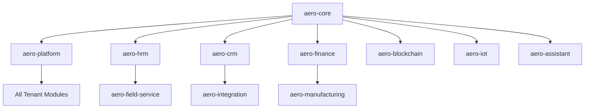

# Aero Enterprise Suite SaaS - Complete Technical Documentation

## 📋 Table of Contents

1. [Architecture Overview](#architecture-overview)
2. [Package Structure](#package-structure)
3. [API Documentation](#api-documentation)
4. [Module Integration](#module-integration)
5. [Database Schema](#database-schema)
6. [Frontend Components](#frontend-components)
7. [Security Implementation](#security-implementation)
8. [Performance Optimization](#performance-optimization)
9. [Deployment Guide](#deployment-guide)
10. [Maintenance & Monitoring](#maintenance--monitoring)

---

## 🏗️ Architecture Overview

### Multi-Tenant SaaS Architecture
The Aero Enterprise Suite is built as a **multi-tenant, multi-module SaaS ERP system** with:

- **Laravel 11** backend framework
- **Inertia.js v2** + **React 18** frontend
- **Tailwind CSS v4** + **HeroUI** design system
- **MySQL/PostgreSQL** database with tenant isolation
- **Redis** for caching and session management
- **Queue system** for background processing

### Monorepo Structure
```
packages/
├── aero-core/          # Authentication, users, RBAC, base models
├── aero-platform/      # Multi-tenancy, billing, subscriptions
├── aero-hrm/          # Human Resource Management
├── aero-crm/          # Customer Relationship Management
├── aero-finance/      # Finance & Accounting (25 models)
├── aero-manufacturing/# Manufacturing & Production (16 models)
├── aero-analytics/    # Business Intelligence & Analytics (15 models)
├── aero-field-service/# Field Service Management (15+ models)
├── aero-integration/  # Third-party Integrations (10+ models)
├── aero-healthcare/   # Healthcare Management (HIPAA-compliant)
├── aero-real-estate/  # Property Management
├── aero-education/    # Student Information System / LMS
├── aero-iot/         # IoT Device Management
├── aero-assistant/   # AI/ML Assistant (RAG-powered)
├── aero-blockchain/  # Distributed Ledger Technology (10 models)
└── aero-ui/          # Shared UI Components & Pages
```

### Tenant Isolation Strategy
- **Database-per-tenant**: Each tenant has isolated database (`tenant{id}`)
- **Central database**: Stores tenants, domains, plans, subscriptions
- **Domain-based routing**: `{tenant}.domain.com` resolution
- **Middleware protection**: Automatic tenant context injection

---

## 📦 Package Structure

Each package follows standardized Laravel structure:

```
packages/aero-{module}/
├── composer.json           # Package metadata & dependencies
├── config/                 # Configuration files
├── database/
│   ├── migrations/         # Database migrations
│   ├── factories/          # Model factories
│   └── seeders/            # Database seeders
├── resources/
│   ├── js/                 # React components & pages
│   │   ├── Pages/          # Inertia pages
│   │   ├── Components/     # Reusable components
│   │   └── Forms/          # Form components
│   └── views/              # Blade templates
├── routes/
│   ├── web.php             # Web routes
│   ├── api.php             # API routes
│   ├── tenant.php          # Tenant-scoped routes
│   └── admin.php           # Admin routes
├── src/
│   ├── Http/
│   │   ├── Controllers/    # Controllers
│   │   ├── Middleware/     # Middleware
│   │   └── Requests/       # Form requests
│   ├── Models/             # Eloquent models
│   ├── Providers/          # Service providers
│   ├── Services/           # Business logic services
│   └── Policies/           # Authorization policies
└── tests/                  # Package tests
```

---

## 🔌 API Documentation

### Authentication Endpoints
```http
POST /api/auth/login
POST /api/auth/logout
POST /api/auth/register
POST /api/auth/refresh
GET  /api/auth/user
```

### Core Module APIs

#### Users Management
```http
GET    /api/users              # List users with pagination
POST   /api/users              # Create new user
GET    /api/users/{id}         # Get user details
PUT    /api/users/{id}         # Update user
DELETE /api/users/{id}         # Delete user
POST   /api/users/{id}/invite  # Send invitation
```

#### HRM Endpoints
```http
GET    /api/hrm/employees           # Employee management
GET    /api/hrm/departments         # Department structure
GET    /api/hrm/leaves             # Leave management
GET    /api/hrm/timesheets         # Time tracking
GET    /api/hrm/payroll            # Payroll processing
GET    /api/hrm/performance        # Performance reviews
```

#### Finance Module
```http
GET    /api/finance/accounts           # Chart of accounts
GET    /api/finance/transactions      # Financial transactions
GET    /api/finance/invoices          # Invoice management
GET    /api/finance/payments          # Payment processing
GET    /api/finance/budgets           # Budget planning
GET    /api/finance/reports           # Financial reporting
```

#### Blockchain APIs
```http
GET    /api/blockchain/networks       # Blockchain networks
GET    /api/blockchain/wallets        # Crypto wallets
GET    /api/blockchain/transactions   # Blockchain transactions
GET    /api/blockchain/contracts      # Smart contracts
GET    /api/blockchain/tokens         # Token management
GET    /api/blockchain/analytics      # Blockchain analytics
```

### Response Format
All API responses follow consistent format:
```json
{
  "data": {...},
  "message": "Success message",
  "meta": {
    "pagination": {...},
    "filters": {...}
  }
}
```

---

## 🔗 Module Integration

### Inter-Module Dependencies


### Module Communication
- **Event-driven architecture**: Laravel events for inter-module communication
- **Service layer**: Shared services for common functionality
- **Repository pattern**: Consistent data access across modules
- **Observer pattern**: Model observers for cross-module updates

---

## 🗄️ Database Schema

### Core Tables
- `users` - User authentication and profiles
- `roles` - Role-based access control
- `permissions` - Granular permission system
- `tenants` - Multi-tenant configuration
- `subscriptions` - SaaS billing and plans

### Module Tables Summary
- **HRM**: 15+ tables (employees, departments, leaves, timesheets, etc.)
- **Finance**: 25 tables (accounts, transactions, invoices, budgets, etc.)
- **Manufacturing**: 16 tables (products, BOMs, work orders, quality, etc.)
- **Blockchain**: 10 tables (blockchains, wallets, transactions, contracts, etc.)
- **IoT**: 12+ tables (devices, sensors, alerts, automation, etc.)
- **Healthcare**: 20+ tables (patients, providers, appointments, etc.)

### Foreign Key Relationships
- Tenant-scoped models automatically filtered
- User relationships across all modules
- Polymorphic relationships for flexible associations
- Soft deletes implemented throughout

---

## 🎨 Frontend Components

### Design System
- **HeroUI Components**: Button, Card, Modal, Input, Select, Table
- **Heroicons**: Consistent iconography
- **Tailwind CSS v4**: Utility-first styling
- **Theme Support**: CSS variables for customization
- **Dark Mode**: Complete dark mode support

### Page Layout Pattern
All pages follow standardized structure:
```jsx
// 1. Theme radius helper
const getThemeRadius = () => { ... };

// 2. Responsive breakpoints
const [isMobile, setIsMobile] = useState(false);

// 3. State management
const [loading, setLoading] = useState(false);
const [data, setData] = useState([]);

// 4. Stats data for StatsCards
const statsData = useMemo(() => [...], [stats]);

// 5. Permission checks
const canCreate = auth.permissions?.includes('resource.create');

// 6. Data fetching with axios
const fetchData = useCallback(async () => { ... }, []);

// Render: Modals → Card → Header → Body → StatsCards → Filters → Table
```

### Reusable Components
- `StatsCards` - Dashboard statistics display
- `EnhancedModal` - Consistent modal interface
- `DataTable` - Paginated table component
- `FormComponents` - Validated form inputs
- `Charts` - Analytics visualization
- `Filters` - Search and filter interface

---

## 🔒 Security Implementation

### Multi-Tenant Security
- **Tenant isolation**: Database-level separation
- **Middleware protection**: Automatic tenant validation
- **Domain verification**: Secure subdomain routing
- **Cross-tenant prevention**: Strict data access controls

### Authentication & Authorization
- **Laravel Sanctum**: API token authentication
- **Role-based access**: Granular permission system
- **2FA Support**: Time-based OTP integration
- **Session management**: Secure session handling

### Data Protection
- **Encryption**: Sensitive data encryption at rest
- **HTTPS enforcement**: SSL/TLS for all communications
- **Input validation**: Comprehensive form validation
- **SQL injection prevention**: Eloquent ORM protection
- **XSS protection**: React JSX automatic escaping

### HIPAA Compliance (Healthcare Module)
- **PHI encryption**: Patient health information protection
- **Audit logging**: Complete access trail
- **Access controls**: Need-to-know basis access
- **Business associate agreements**: Compliance documentation

---

## ⚡ Performance Optimization

### Caching Strategy
- **Redis caching**: Query result caching
- **Model caching**: Eloquent model caching
- **Route caching**: Compiled route caching
- **View caching**: Template compilation caching
- **Asset optimization**: Frontend asset minification

### Database Optimization
- **Query optimization**: N+1 query prevention
- **Index strategy**: Proper database indexing
- **Connection pooling**: Database connection optimization
- **Read replicas**: Read/write separation for scaling

### Frontend Performance
- **Code splitting**: Dynamic import optimization
- **Lazy loading**: Component lazy loading
- **Image optimization**: WebP format conversion
- **CDN integration**: Static asset delivery
- **Bundle analysis**: JavaScript bundle optimization

### Queue Processing
- **Background jobs**: Asynchronous task processing
- **Queue monitoring**: Job failure tracking
- **Retry logic**: Automatic job retry mechanisms
- **Priority queues**: Critical task prioritization

---

## 🚀 Deployment Guide

### Infrastructure Requirements
- **Web Server**: Nginx/Apache with PHP 8.2+
- **Database**: MySQL 8.0+ or PostgreSQL 13+
- **Cache**: Redis 6.0+
- **Queue**: Redis/Amazon SQS
- **Storage**: Local/S3-compatible storage

### Environment Configuration
```env
# Application
APP_ENV=production
APP_DEBUG=false
APP_URL=https://your-domain.com

# Database
DB_CONNECTION=mysql
DB_HOST=your-db-host
DB_DATABASE=eos365
DB_USERNAME=your-username
DB_PASSWORD=your-password

# Multi-tenancy
PLATFORM_DOMAIN=your-domain.com
ADMIN_DOMAIN=admin.your-domain.com

# Cache
REDIS_HOST=your-redis-host
REDIS_PASSWORD=your-redis-password
REDIS_PORT=6379

# Queue
QUEUE_CONNECTION=redis
```

### Docker Deployment
```yaml
version: '3.8'
services:
  app:
    build: .
    ports:
      - "80:80"
    environment:
      - APP_ENV=production
    volumes:
      - ./storage:/var/www/storage
  
  mysql:
    image: mysql:8.0
    environment:
      MYSQL_DATABASE: eos365
      MYSQL_ROOT_PASSWORD: password
  
  redis:
    image: redis:6.0-alpine
```

### CI/CD Pipeline
- **GitHub Actions**: Automated testing and deployment
- **Code quality**: PHPStan, Pint formatting
- **Security scanning**: Vulnerability assessments
- **Performance testing**: Load testing automation

---

## 🔧 Maintenance & Monitoring

### Health Monitoring
- **Application monitoring**: Laravel Telescope integration
- **Performance metrics**: Response time tracking
- **Error tracking**: Exception monitoring
- **Uptime monitoring**: Service availability tracking

### Backup Strategy
- **Database backups**: Automated daily backups
- **File storage backups**: Asset and upload backups
- **Configuration backups**: Environment and config backups
- **Disaster recovery**: Restore procedures documentation

### Maintenance Tasks
- **Log rotation**: Automated log cleanup
- **Cache clearing**: Scheduled cache refresh
- **Queue monitoring**: Background job health checks
- **Security updates**: Regular dependency updates

### Scaling Considerations
- **Horizontal scaling**: Load balancer configuration
- **Database sharding**: Multi-tenant database scaling
- **Cache scaling**: Redis cluster setup
- **CDN integration**: Global content delivery

---

## 📞 Support & Contact

For technical support and documentation updates:
- **Email**: developers@aeroenterprise.com
- **Documentation**: Internal wiki system
- **Issue tracking**: GitHub Issues
- **Slack channel**: #aero-development

---

*Last updated: January 28, 2026*
*Version: 6.0.0*
*Documentation maintained by: Aero Development Team*